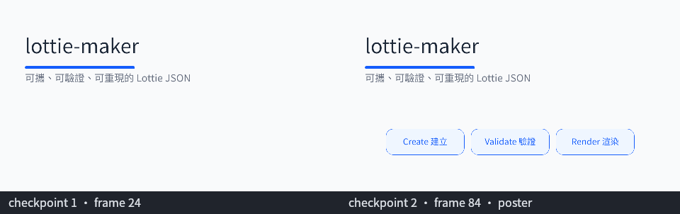
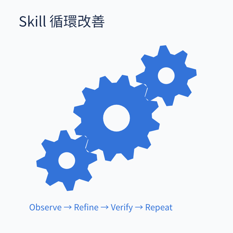
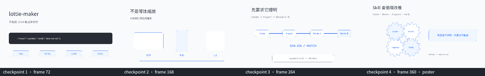
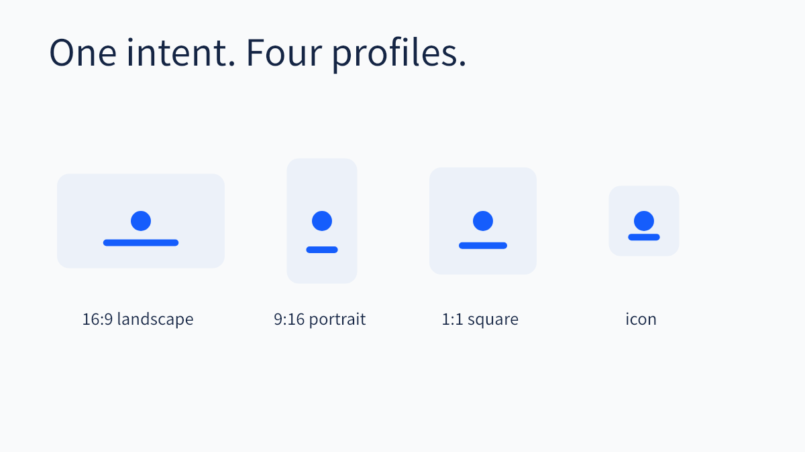
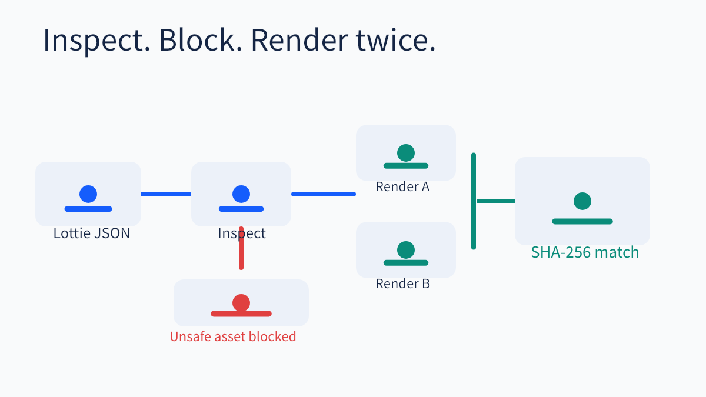

# lottie-maker

`lottie-maker` is a standalone, portable Agent Skill for creating, revising, diagnosing,
validating, and deterministically previewing Lottie JSON animation bundles. It generalizes the
motion-design workflow into reusable profiles and a custom canvas mode without tying the skill to
one publishing pipeline, aspect ratio, language, or product.


The animation above is [`examples/hello-lottie-maker`](examples/hello-lottie-maker/): a validated
bundle authored, storyboard-reviewed, rendered, and hash-verified entirely by this skill. The GIF
is a preview; the canonical artifact is its `animation.json`.

The canonical output is always `animation.json`. Each created bundle also keeps its editable brief,
motion rationale, local assets, deterministic preview report, poster, and contact sheet.

## What it does

- Creates landscape, portrait, square, icon, or custom-canvas Lottie bundles.
- Preserves unknown fields when revising imported JSON.
- Diagnoses expressions, unsupported layers, remote assets, missing files, symlinks, and timeline
  mismatches without rewriting the source.
- Applies a conservative portable subset on top of the official Lottie schema.
- Renders multilingual text with a bundled Noto Sans CJK TC font through CanvasKit/Skottie.
- Verifies reproducibility by comparing SHA-256 hashes from two renders.
- Optionally encodes complete frame sequences as MP4 or GIF when local `ffmpeg` is available.

## Requirements

- Node.js 22 or newer
- npm
- Optional: `ffmpeg` for MP4/GIF previews

Install runtime dependencies after cloning:

```bash
npm ci --ignore-scripts --prefix skills/lottie-maker
```

## Install as an Agent Skill

With the Skills CLI:

```bash
npx skills add FWcloud916/skill-lottie-maker --skill lottie-maker
```

With Codex, install the repository as a plugin or copy `skills/lottie-maker` into the active skills
directory. The plugin manifest lives at `.codex-plugin/plugin.json`.

With Claude Code:

```bash
claude plugin marketplace add FWcloud916/skill-lottie-maker
claude plugin install lottie-maker@skill-lottie-maker
```

## CLI quick start

```bash
node skills/lottie-maker/scripts/lottie-maker.mjs init \
  --id hello-motion --profile landscape-16x9 --title "Hello 動畫" \
  --out ./work --dry-run

node skills/lottie-maker/scripts/lottie-maker.mjs init \
  --id hello-motion --profile landscape-16x9 --title "Hello 動畫" \
  --out ./work

node skills/lottie-maker/scripts/lottie-maker.mjs validate ./work/hello-motion --json
node skills/lottie-maker/scripts/lottie-maker.mjs render ./work/hello-motion --out ./preview
node skills/lottie-maker/scripts/lottie-maker.mjs verify ./work/hello-motion --out ./verify
```

Profiles are `landscape-16x9`, `portrait-9x16`, `square-1x1`, `icon`, and `custom`. Custom mode also
requires `--width`, `--height`, `--fps`, and `--duration`.

## Reproducible examples

The [`examples`](examples/) directory contains five validated bundles, shown below, plus one
intentionally invalid remote-asset fixture for read-only diagnosis. Every valid example is rendered
twice and hash-compared by the repository verification gate; one of them also carries
[rendered-geometry contact claims](skills/lottie-maker/references/brief-contract.md#geometry-claims)
checked against isolated per-layer pixels, not just declared bounds.

### [hello-lottie-maker](examples/hello-lottie-maker/) — README hero

960×540 · `custom` profile · mixed Latin/CJK copy · two composition checkpoints

The animation at the top of this README. Reproduce it end to end, including its storyboard
preview stage:

```bash
node skills/lottie-maker/scripts/lottie-maker.mjs validate examples/hello-lottie-maker --json
node skills/lottie-maker/scripts/lottie-maker.mjs storyboard examples/hello-lottie-maker --out /tmp/hello-storyboard
node skills/lottie-maker/scripts/lottie-maker.mjs verify examples/hello-lottie-maker --out /tmp/hello-verify
```

The storyboard renders exactly the declared composition checkpoints for review before any full
render:



### [skill-improvement-gear-loop](examples/skill-improvement-gear-loop/)

720×720 · `custom` profile · 30 FPS seamless loop · three-gear mechanical mesh



A hand-authored looping animation whose gear train is checked for genuine tooth engagement — not
just visual proximity — by rendering each gear in isolation and measuring contact from the
resulting pixel masks:

```bash
node skills/lottie-maker/scripts/lottie-maker.mjs geometry examples/skill-improvement-gear-loop --out /tmp/gear-geometry --json
```

### [threads-skill-intro](examples/threads-skill-intro/)

1920×1080 · `custom` profile · 384 frames · four-act workflow walkthrough



A generated four-act narrative — inputs converging, aspect-ratio recomposition, the validation
pipeline, and an interlocked four-gear improvement loop — built entirely from the shared
construction primitives in [`emit.mjs`](skills/lottie-maker/scripts/lib/emit.mjs), the same module
`init` uses for every new bundle. The storyboard above renders exactly its four declared
composition checkpoints, one per act.

### [profile-portability](examples/profile-portability/)

1200×675 · `landscape-16x9` profile · one intent recomposed across four canvas shapes



### [deterministic-verification](examples/deterministic-verification/)

1200×675 · `landscape-16x9` profile · inspect, block, render twice, hash-match



Every example accepts the same `validate`, `render`, and `verify` commands shown above; run
`storyboard` on any bundle that declares composition checkpoints, and `geometry` on any bundle that
declares `composition.geometry` claims.

To revise the only copy of an imported animation safely, clone it byte-for-byte and audit the
path-level diff after editing:

```bash
node skills/lottie-maker/scripts/lottie-maker.mjs clone ./original.json \
  --id revised-copy --out ./work --dry-run
node skills/lottie-maker/scripts/lottie-maker.mjs clone ./original.json \
  --id revised-copy --out ./work
node skills/lottie-maker/scripts/lottie-maker.mjs compare \
  ./original.json ./work/revised-copy/animation.json --json
```

## Bundle contract

```text
<id>/
├── brief.yaml
├── animation.json
├── motion.md
└── assets/
    └── fonts/
```

Render output is separate from the source bundle and contains sampled frames, `poster.png`,
`contact-sheet.png`, and `report.json`. See [project overview](docs/project-overview.md) and the
skill's [brief contract](skills/lottie-maker/references/brief-contract.md) for details.

## Development

```bash
npm test --prefix skills/lottie-maker
npm run lint --prefix skills/lottie-maker
npm run format:check --prefix skills/lottie-maker
bash scripts/verify.sh
```

Development progress is managed in `progress/` with the `progress-tracker` Agent Skill. WIP is one.

## Security and portability

The validator rejects expressions, remote/data URLs, escaping or symlinked assets, and unsupported
layer types. The skill does not fetch assets, call paid APIs, publish, upload, or access credentials.
The official schema result is reported separately as advisory because the Community Specification
schema does not currently cover every widely-rendered text-layer field.

## License

MIT. Bundled third-party material retains its own license; see [THIRD_PARTY_NOTICES.md](THIRD_PARTY_NOTICES.md).
